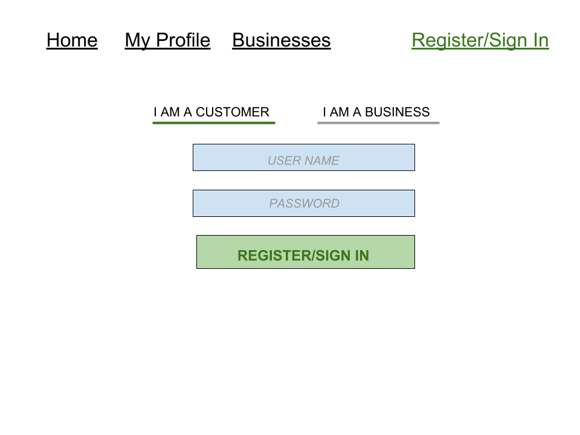
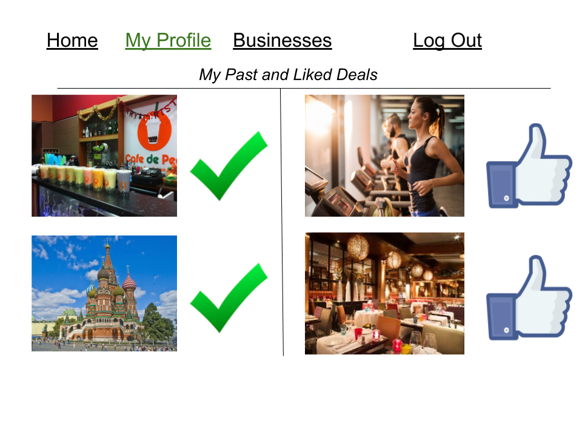
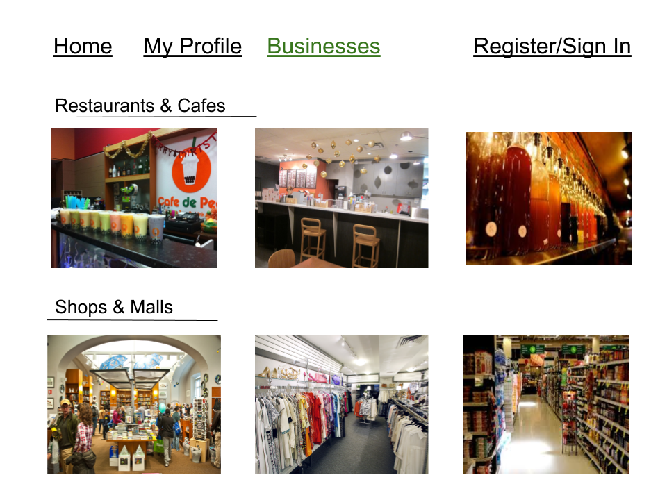
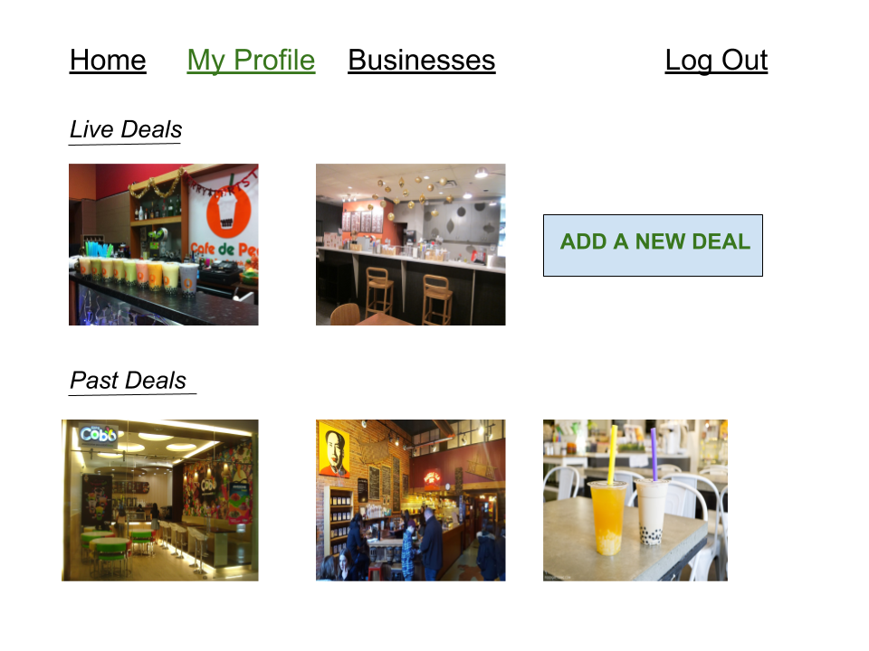
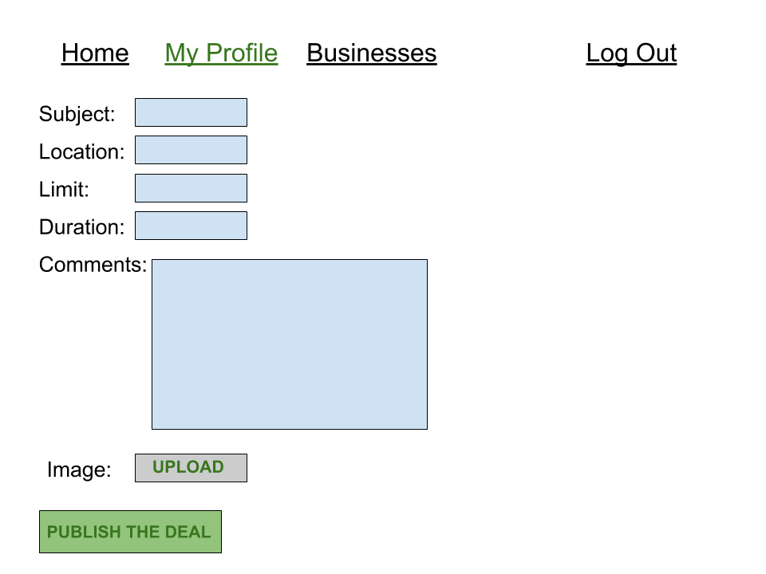
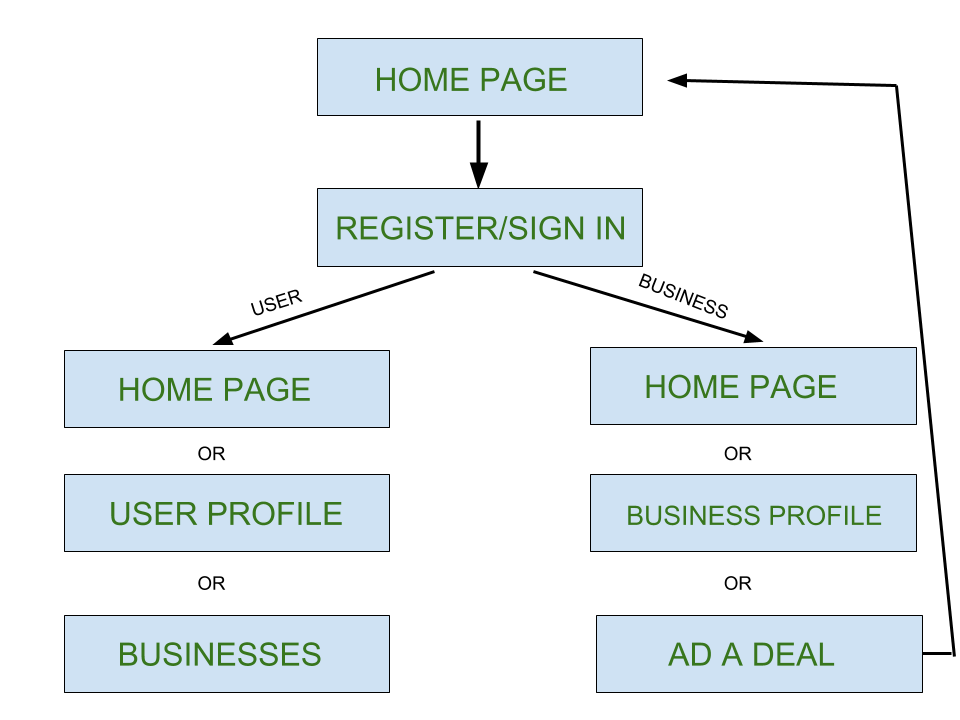

# KuponHero

## Overview


In Uzbekistan(my home country), especially in Tashkent(the capital city), new businesses such as cafes, restaurants, shops, educational centers, gyms are being opened every day. Such new businesses or existing ones resort to expensive ad platforms such as TV or popular e-newspapers or inefficient ones such as flyer distribution to advertise their openings or new deals/discounts. In the opposite side, people are constantly looking for such deals to save money or enjoy an activity with their friends, but are frustrated as their is no go-to platform that can be used to browse through the deals. 

KuponHero will fulfill this need in the market as a platform for businesses to place their deals and for users to find out deals that may interest them.

## Data Model

The application will store Users, Businesses and Deals

* businesses can have multiple deals, active or past, (via reference to Deal objects)
* users, when signed in, can see the deals they have participated in the past and the ones they liked/wished for (via reference to Deal objects) 
* each deal contains a reference to a Business object - the organizer of the deal

An Example User:

```javascript
{
  full_name: {type: String,required:true},
  username : {type: String, required:true, unique:true},
  email: {type: String, required:true, unique:true},
  password:{type:String,required:true},
  pastDeals : [{ type: mongoose.Schema.Types.ObjectId, ref: 'Deal' }]
}
```

An Example Merchant:

```javascript
{
  username: {type: String, required: true,unique:true},
  email: {type:String, required:true, unique:true},
  password:{type:String, required:true},
  location: {type: String, required: true},
  category: {type: String, required:true}
}
```
An Example Deal:

```javascript
{
 merchant_id: { type: mongoose.Schema.Types.ObjectId, ref: 'Merchant' },
  participants: [{ type: mongoose.Schema.Types.ObjectId, ref: 'User' }],
  subject: {type: String, required:true}, 
  limit: {type : Number, required: true}, 
  location :{type:String, required:true},
  current_used: {type : Number},
  active: {type : Boolean},
  category: {type : String, required: true},
  comments: {type : String}
}
```

## [Link to Commented First Draft Schema](models) 


## Wireframes

Home Page of the website


Sign In or Registration page



User Profile (once s/he is signed in)



Businesses Page (any user can browse through the businesses in the database by category)



Business Profile (once they are signed in)



Adding a New Deal (redirect from Business Profile Page)



## Site map


## User Stories or Use Cases

1. as non-registered user, I can register a new account with the site
2. as non-registered user, I can browse through the deals
3. as a user, I can log in to the site
4. as a user, I can participate in most of the deals
5. as non-registered business, I can register a new account with the site
6. as a business, I can publish deals on the site

## Research Topics

* (5 points) Integrate User Authentication 
  * I have used Passport.js for user authentication
* (3 points) Perform client side form validation 
  * Form validation is performed in login & register forms (e.g. client will get an error if s/he tries to register with already used email or username)
* (2 points) Bootstrap 
  * I have used Bootstrap for design throughout my site

Total 10 points

## [Link to Initial Main Project File](app.js) 


## Annotations / References Used

1. [Passport.js official documentation](http://passportjs.org/docs)
2. [Boostrap official documentation](https://getbootstrap.com/docs/4.1/getting-started/introduction/)
4. [tutorial on passport.js](https://www.youtube.com/watch?v=Z1ktxiqyiLA)